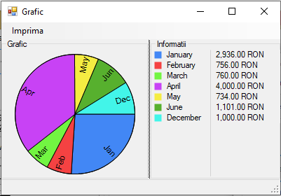
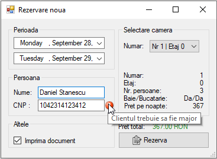
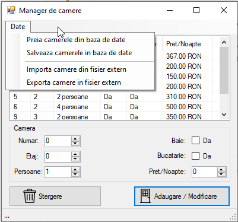
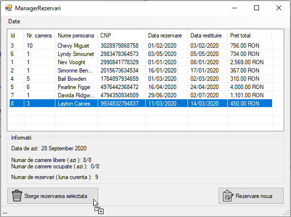
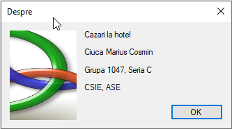

# Cazari la hotel
Aplicatie interna care administreaza cazarile la un hotel. Aplicatia este scrisa in C# pentru Windows si foloseste fisiere de tip .accdb (Microsoft Access) pentru stocarea bazei de date.

### Meniul principal
 

### Grafic cu incasarile pe fiecare luna
 

### Formularul pentru o rezervare noua
 

### Lista camerelor
 

### Lista rezervarilor
 

### Despre
 

## Download
<a href="https://github.com/ciucacosmin109/Cazari-la-hotel/releases">Releases</a> 

## License
[GPL v3](./LICENSE)
